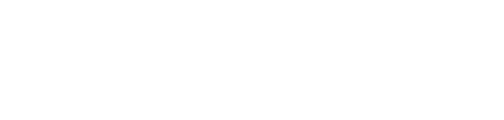
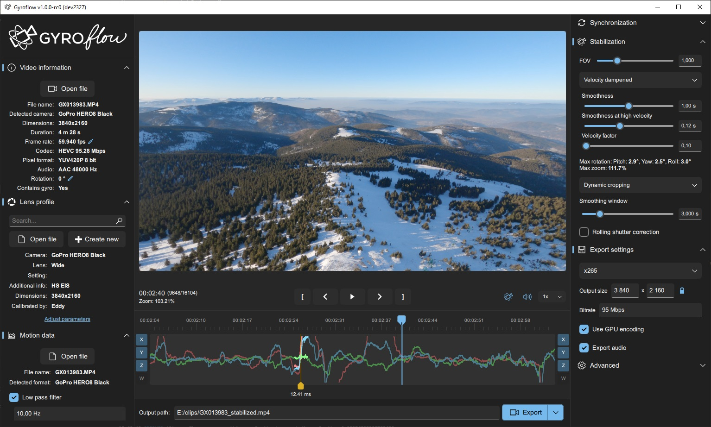

  <h1 align="center">
    
    
  </h1>

  

    Video stabilization using gyroscope data
     
     
    <a href="https://gyroflow.xyz">Homepage</a> •
    <a href="https://github.com/gyroflow/gyroflow/releases">Download</a> •
    <a href="https://docs.gyroflow.xyz">Documentation</a> •
    <a href="https://discord.gg/WfxZZXjpke">Discord</a> •
    <a href="https://github.com/gyroflow/gyroflow/issues">Report bug</a> •
    <a href="https://github.com/gyroflow/gyroflow/issues">Request feature</a>
  

  

    
    
    
    
    
  

## About the project
Gyroflow is an application that can stabilize your video by using motion data from a gyroscope and optionally an accelerometer. Modern cameras record that data internally (GoPro, Sony, Insta360 etc), and this application stabilizes the captured footage precisely by using them. It can also use gyro data from an external source (eg. from Betaflight blackbox).

[Trailer / results video](https://www.youtube.com/watch?v=QR-SINyvNyI)

  
  

## Features
- Real time preview, params adjustments and all calculations
- GPU processing and rendering, all algorithms fully multi-threaded
- Rolling shutter correction
- Supports already stabilized GoPro videos (captured with Hypersmooth enabled) (Hero 8 and up)
- Supports and renders 10-bit videos (up to 16-bit 4:4:4:4 for regular codecs and 32-bit float for OpenEXR - works directly on YUV data to keep maximum quality)
- Customizable lens correction strength
- Render queue
- Keyframes
- Ability to create custom settings presets
- [OpenFX plugin](https://github.com/gyroflow/gyroflow-ofx) (eg. for DaVinci Resolve), which allows you to apply stabilization in video editor without any transcoding
- [Gyroflow Toolbox](https://gyroflowtoolbox.io) - A Final Cut Pro effect which allows you to import a Gyroflow Project without transcoding
- Visual chart with gyro data (can display gyro, accel, magnetometer and quaternions)
- Visual display of smoothed quaternions
- Modern responsive user interface with Dark and Light theme
- Adaptive zoom (dynamic cropping)
- Support for image sequences (PNG, OpenEXR, CinemaDNG)
- Based on [telemetry-parser](https://github.com/AdrianEddy/telemetry-parser) - supports all gyro sources out of the box
- Gyro low pass filter, arbitrary rotation (pitch, roll, yaw angles) and orientation
- Multiple gyro integration methods for orientation determination
- Multiple video orientation smoothing algorithms, including horizon levelling and per-axis smoothness adjustment.
- Cross-platform - works on Windows/Linux/Mac/Android/iOS
- Multiple UI languages
- Supports variable and high frame rate videos, all calculations are done on timestamps
- H.264/AVC, H.265/HEVC, ProRes, DNxHD, CineForm, PNG and OpenEXR outputs, with H.264 and H.265 fully GPU accelerated (ProRes also accelerated on Apple Silicon)
- Automatic lens calibration process
- Fully zero-copy GPU preview rendering
- Core engine is a separate library without external dependencies (no Qt, no ffmpeg, no OpenCV), and can be used to create OpenFX and Adobe plugins (on the TODO list)
- Automatic updates of lens profile database
- Built-in official lens profiles for GoPro: HERO 6, 7, 8, 9, 10, 11, 12; RunCam: Thumb, ThumbPro, 5 Orange; Insta360: GO 2, GO 3 in all shooting modes

## Supported gyro sources
- [x] GoPro (HERO 5 and later)
- [x] Sony (a1, a7c, a7r V, a7 IV, a7s III, a9 II, FX3, FX6, FX9, RX0 II, RX100 VII, ZV1, ZV-E10, ZV-E1, a6700)
- [x] Insta360 (OneR, OneRS, SMO 4k, Go, GO2, GO3, Caddx Peanut, Ace, Ace Pro)
- [x] DJI (Avata, O3 Air Unit, Action 2, Action 4)
- [x] Blackmagic RAW (*.braw)
- [x] RED RAW (V-Raptor, KOMODO) (*.r3d)
- [x] Betaflight blackbox (*.bfl, *.bbl, *.csv)
- [x] ArduPilot logs (*.bin, *.log)
- [x] Gyroflow [.gcsv log](https://docs.gyroflow.xyz/app/technical-details/gcsv-format)
- [x] iOS apps: [`Sensor Logger`](https://apps.apple.com/us/app/sensor-logger/id1531582925), [`G-Field Recorder`](https://apps.apple.com/at/app/g-field-recorder/id1154585693), [`Gyro`](https://apps.apple.com/us/app/gyro-record-device-motion-data/id1161532981), [`GyroCam`](https://apps.apple.com/us/app/gyrocam-professional-camera/id1614296781)
- [x] Android apps: [`Sensor Logger`](https://play.google.com/store/apps/details?id=com.kelvin.sensorapp&hl=de_AT&gl=US), [`Sensor Record`](https://play.google.com/store/apps/details?id=de.martingolpashin.sensor_record), [`OpenCamera Sensors`](https://github.com/MobileRoboticsSkoltech/OpenCamera-Sensors), [`MotionCam Pro`](https://play.google.com/store/apps/details?id=com.motioncam.pro)
- [x] Runcam CSV (Runcam 5 Orange, iFlight GOCam GR, Runcam Thumb, Mobius Maxi 4K)
- [x] Hawkeye Firefly X Lite CSV
- [x] XTU (S2Pro, S3Pro)
- [x] WitMotion (WT901SDCL binary and *.txt)
- [x] Vuze (VuzeXR)
- [x] KanDao (Obisidian Pro)
- [x] [CAMM format](https://developers.google.com/streetview/publish/camm-spec)

### Info for cameras not on the list

- For cameras which do have built-in gyro, please contact us and we will implement support for that camera. Refer to the [documentation](https://docs.gyroflow.xyz) for information about the gyro logging process.
- For cameras which don't have built-in gyro, please consider using Betaflight FC or check out our [flowshutter](https://github.com/gyroflow/flowshutter) project.

## Installation
### Windows
- Download `Gyroflow-windows64.zip` from the [Releases](https://github.com/gyroflow/gyroflow/releases) page, extract the files somewhere and run `Gyroflow.exe`
- If it shows an error about `VCRUNTIME140.dll`, [install VC redist](https://aka.ms/vs/17/release/vc_redist.x64.exe)

### MacOS
- Download `Gyroflow-mac-universal.dmg` from the [Releases](https://github.com/gyroflow/gyroflow/releases) page, run the downloaded file, and drag & drop `Gyroflow` app to the Applications folder (or anywhere you want, like on Desktop)
- You can also install using brew: `brew install gyroflow`. To upgrade Gyroflow, run `brew update` then `brew upgrade gyroflow`

### Linux
- Download `Gyroflow-linux64.tar.gz` from the [Releases](https://github.com/gyroflow/gyroflow/releases) page, extract the files somewhere and run `./Gyroflow` in the terminal.
- If that doesn't work, you can try the `Gyroflow-linux64.AppImage`, but the .tar.gz one is preferred.
- Make sure you have latest graphics drivers installed
- Possibly needed packages: `sudo apt install libva2 libvdpau1 libasound2 libxkbcommon0 libpulse0 libc++-dev libvulkan1`
- GPU specific packages:
    - NVIDIA: `nvidia-opencl-icd nvidia-vaapi-driver nvidia-vdpau-driver nvidia-egl-icd nvidia-vulkan-icd libnvcuvid1 libnvidia-encode1`
    - Intel: `intel-media-va-driver i965-va-driver beignet-opencl-icd intel-opencl-icd`
    - AMD: `mesa-vdpau-drivers mesa-va-drivers mesa-opencl-icd libegl-mesa0 mesa-vulkan-drivers`

### Nightly build
Latest development version is always available here: https://gyroflow.xyz/devbuild/.

## Minimum system requirements:
- Windows 10 64-bit (1809 or later)
    - If you have Windows "N" install, go to `Settings` -> `Apps` -> `Optional features` -> `Add a feature` -> enable `Media Feature Pack`
- macOS 10.14 or later (both Intel and Apple Silicon are supported natively)
- Linux:
    - `.tar.gz` package (recommended): Debian 10+, Ubuntu 18.10+, CentOS 8.2+, openSUSE 15.3+. Other distros require glibc 2.28+ (`ldd --version` to check)
    - `.AppImage` should work everywhere
- Android 6+

## Help and support
For general support and discussion, you can find the developers and other users on the [Gyroflow Discord server](https://discord.gg/BBJ2UVAr2D).

For companies or people wishing to get in touch with the team privately for collaborative purposes: devteam@gyroflow.xyz.

## Test data
You can download some clips with gyro data from here: https://drive.google.com/drive/folders/1sbZiLN5-sv_sGul1E_DUOluB5OMHfySh?usp=sharing

## Roadmap

See the [open issues](https://github.com/gyroflow/gyroflow/issues) for a list of proposed features and known issues.
There's also a ton of TODO comments throughout the code.

### Video editor plugins
Gyroflow OpenFX plugin is available [here](https://github.com/gyroflow/gyroflow-ofx). OpenFX plugin was tested in DaVinci Resolve

[Gyroflow Toolbox](https://github.com/latenitefilms/GyroflowToolbox) allows you to import Gyroflow Projects into a Final Cut Pro effect.

Adobe After Effects plugin is planned, but not ready yet

## Contributing

Contributions are what make the open source community such an amazing place to learn, inspire, and create. Any contributors are **greatly appreciated**.
* If you have suggestions for adding or removing features, feel free to [open an issue](https://github.com/gyroflow/gyroflow/issues/new) to discuss it.
* If you want to implement a feature, you can fork this project, implement your code and open a pull request.

### Translations
Currently *Gyroflow* is available in:
* **English** (base language)
* **Chinese Simplified** (by [DusKing1](https://github.com/DusKing1))
* **Chinese Traditional** (by [DusKing1](https://github.com/DusKing1))
* **Czech** (by Jakub Ešpandr, VitroidFPV, davidazarian, Michael Kmoch)
* **Danish** (by [ElvinC](https://github.com/ElvinC))
* **Finnish** (by Jesse Julkunen)
* **French** (by KennyDorion)
* **Galician** (by Martín Costas)
* **German** (by [Grommi](https://github.com/Gro2mi) and [Nicecrash](https://github.com/B-nutze-RR))
* **Greek** (by [Stamatis Galiatsatos](https://github.com/Logicenios))
* **Indonesian** (by Aloysius Puspandono)
* **Italian** (by Rosario Casciello)
* **Japanese** (by 井上康)
* **Korean** (by EP45)
* **Norwegian** (by [MiniGod](https://github.com/MiniGod) and [alexagv](https://github.com/alexagv))
* **Polish** (by [AdrianEddy](https://github.com/AdrianEddy))
* **Portuguese Brazilian** (by KallelGaNewk)
* **Portuguese** (by Ricardo Pimentel)
* **Russian** (by Андрей Гурьянов, redstar01 and lukdut)
* **Slovak** (by Radovan Leitman and Eduard Petrovsky)
* **Spanish** (by Pelado-Mat)
* **Turkish** (by [Metin Oktay Yılmaz](https://github.com/mettinoktay))
* **Ukrainian** (by Artem Alexandrov)

Help us translate *Gyroflow* to your language! We use *crowdin* to manage translations and you can contribute there: https://crowdin.com/project/gyroflow

#### I want to contribute but I don't know Rust or QML
* The Rust book is a great way to get started with Rust: https://doc.rust-lang.org/book/
* Additional useful resources for Rust: https://quickref.me/rust and https://cheats.rs/
* For the UI stuff, there's a nice QML book by The Qt Company: https://www.qt.io/product/qt6/qml-book

## Development
### Used languages and technologies
*Gyroflow* is written in [Rust](https://www.rust-lang.org/), with UI written in [QML](https://doc.qt.io/qt-6/qmlfirststeps.html). It uses *Qt*, *ffmpeg*, *OpenCV* and *mdk-sdk* external dependencies for the main program, but the core library is written in pure Rust without any external dependencies.

OpenCV usage is kept to a minimum, used only for lens calibration and optical flow (`src/core/calibration/mod.rs` and `src/core/synchronization/opencv.rs`). Core algorithms and undistortion don't use OpenCV.

GPU stuff supports *DirectX*, *OpenGL*, *Metal* and *Vulkan* thanks to *Qt RHI* and *wgpu*.
For GPU processing we use *OpenCL* or *wgpu*, with highly parallelized CPU implementation as a fallback.

### Code structure
1. Entire GUI is in the `src/ui` directory
2. `src/controller.rs` is a bridge between UI and core, it takes all commands from QML and calls functions in core
3. `src/core` contains the whole gyroflow engine and doesn't depend on *Qt* or *ffmpeg*, and *OpenCV* is optional
4. `src/rendering` contains all FFmpeg related code for rendering final video and processing for synchronization
5. `src/core/gpu` contains GPU implementations of the undistortion
6. `src/qt_gpu` contains zero-copy GPU undistortion path, using Qt RHI and GLSL compute shader
7. `src/gyroflow.rs` is the main entry point
8. `mod.rs` or `lib.rs` in each directory act as a main entry of the module (directory name is the module name and `mod.rs` is kind of an entry point)

### Dev environment
`Visual Studio Code` with `rust-analyzer` extension.

For working with QML I recommend to use Qt Creator and load all QML files there, as it has auto-complete and syntax highlighting.
The project also supports UI live reload, it's a super quick way of working with the UI. Just change `live_reload = true` in `gyroflow.rs` and it should work right away. Now every time you change any QML file, the app should reload it immediately.

### Building on Windows
0. Prerequisites: `git`, `7z` and working `powershell`. If you never ran powershell scripts before, run `set-executionpolicy remotesigned` in powershell as admin
1. Get latest stable Rust language from: https://rustup.rs/
    - Please make sure to check the English language pack option when installing the C++ build tools from Visual Studio Installer
2. Install `Just` by running `cargo install --force just`
3. Clone the repo: `git clone https://github.com/gyroflow/gyroflow.git`
4. Enter the project directory and:
    - Install dependencies: `just install-deps`
    - Compile and run: `just run`

### Building on MacOS
0. Prerequisites: `git`, `brew`
1. Get latest stable Rust language from: https://rustup.rs/
2. Install `Just` by running `cargo install --force just`
3. Clone the repo: `git clone https://github.com/gyroflow/gyroflow.git`
4. Enter the project directory and:
    - Install dependencies: `just install-deps`
    - Compile and run: `just run`
    - The first time you run it won't work, run `just deploy` once and then `just run` will work

### Building on Linux
0. Prerequisites: `git`, `7z`, `python`, `apt` package manager (or adjust commands inside scripts if on different distro)
1. Get latest stable Rust language from: https://rustup.rs/
2. Install `Just` by running `cargo install --force just`
3. Clone the repo: `git clone https://github.com/gyroflow/gyroflow.git`
4. Enter the project directory and:
    - Install dependencies: `just install-deps`
    - Compile and run: `just run`

### Building for Android
0. Prerequisites: `git`, `7z`, working `powershell`, Android SDK and NDK. Android is not well supported yet, but the app can be built and somewhat works. Building is supported only on Windows
1. Get latest stable Rust language from: https://rustup.rs/
2. Install `Just` by running `cargo install --force just`
3. Clone the repo: `git clone https://github.com/gyroflow/gyroflow.git`
4. Install Android SDK and NDK r23c and update paths in `_scripts/android.just`
5. Enter the project directory and:
    - Install dependencies: `just android install-deps`
    - Compile the apk and install on device: `just android deploy`

### Building for iOS
0. Prerequisites: `git`, `brew`
1. Get latest stable Rust language from: https://rustup.rs/
2. Install `Just` by running `cargo install --force just`
3. Clone the repo: `git clone https://github.com/gyroflow/gyroflow.git`
4. Enter the project directory and:
    - Install dependencies: `just ios install-deps`
    - Update Team ID, signing keys and provisioning profiles in `_scripts/ios.just`
    - Compile and run on device: `just ios run`

### Profiling on Windows
1. Install and run `Visual Studio Community Edition`
2. Compile and run Gyroflow with the `profile` profile: `just profile`
3. In Visual Studio, go to `Debug -> Performance Profiler...`
    - Under `Target`, open `Change Target` and select `Running Process...`, select the running `gyroflow.exe` process

### Profiling QML
1. Uncomment `config.define("QT_QML_DEBUG", None);` in `build.rs`
2. Comment `cli::run()` in `gyroflow.rs`
3. Run in debug mode with QML debugger args: `cargo run -- "-qmljsdebugger=port:1234,block,services:CanvasFrameRate,EngineControl,DebugMessages"`
4. In Qt Creator go to `Analyze` -> `QML Profiler (Attach to Waiting Application)` and enter port 1234

## License

Distributed under the GPLv3 License with App Store Exception. See [LICENSE](https://github.com/gyroflow/gyroflow/blob/main/LICENSE) for more information.

As additional permission under section 7, you are allowed to distribute [`gyroflow_core`](https://github.com/gyroflow/gyroflow/tree/master/src/core) through an app store, even if that store has restrictive terms and conditions that are incompatible with the GPL, provided that the source is also available under the GPL with or without this permission through a channel without those restrictive terms and conditions.

## Authors

* [AdrianEddy](https://github.com/AdrianEddy/) - *Author of the Rust implementation (code in this repository), author of the UI, GPU processing, rolling shutter correction and advanced rendering features*
* [Elvin Chen](https://github.com/ElvinC/) - *Author of the first version in Python, laid the groundwork to make all this possible*

### Notable contributors
* [Maik Menz](https://github.com/mycosd/) - *Contributed to all areas of Gyroflow with fixes and improvements*
* [Aphobius](https://github.com/Aphobius/) - *Author of the velocity dampened smoothing algorithm*
* [Marc Roeschlin](https://github.com/marcroe/) - *Author of the adaptive zoom algorithm*
* [Ilya Epifanov](https://github.com/ilya-epifanov/) - *Author of the OpenFX plugin*
* [Vladimir Pinchuk](https://github.com/VladimirP1/) - *Author of robust gyro-to-video synchronization algorithm*
* [Chris Hocking](https://github.com/latenitefilms) - *Author of the [Gyroflow Toolbox](https://gyroflowtoolbox.io) Final Cut Pro Plugin*

## Acknowledgements

* [Gyroflow Python version (legacy code)](https://github.com/ElvinC/gyroflow)
* [telemetry-parser](https://github.com/AdrianEddy/telemetry-parser)
