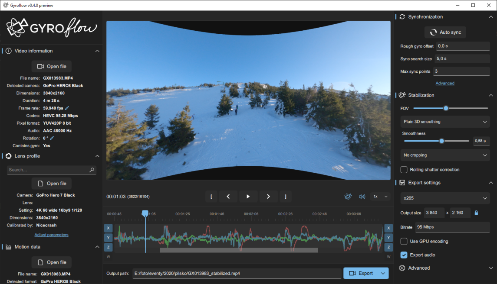

  <h1 align="center">
    
    
  </h1>

  

    Video stabilization using gyroscope data
     
     
    <a href="https://gyroflow.xyz">Homepage</a>
    •
    <a href="https://github.com/AdrianEddy/gyroflow/releases">Download</a>
    •
    <a href="https://docs.gyroflow.xyz">Documentation</a>
    •
    <a href="https://discord.gg/WfxZZXjpke">Discord</a>
    •
    <a href="https://github.com/AdrianEddy/gyroflow/issues">Report bug</a>
    •
    <a href="https://github.com/AdrianEddy/gyroflow/issues">Request feature</a>
  

    

## Table of contents

* [About the project](#about-the-project)
* [Features](#features)
* [Supported gyro sources](#supported-gyro-sources)
* [Roadmap](#roadmap)
* [Contributing](#contributing)
* [Development](#development)
* [License](#license)
* [Authors](#authors)
* [Acknowledgements](#acknowledgements)

## About the project
Gyroflow is a program to stabilize video by using motion data from gyroscope (IMU). Modern cameras record that data internally (GoPro, Sony, Insta360 etc), and this program uses them to stabilize the captured footage very accurately.

## Features
- Real time preview, params adjustments and all calculations
- GPU processing and rendering
- Fully multi-threaded
- Rolling shutter correction
- Supports already stabilized GoPro videos (captured with Hypersmooth enabled) (Hero 8 and up)
- Supports and renders 10-bit videos (and higher, up to 16-bit 4:4:4, direct YUV rendering with no data loss (no conversion to RGB))
- Visual chart with gyro data (supports gyro, accel, magnetometer and quaternions)
- Visual display of smoothed quaternions
- Real time offset adjustments
- Two optical flow methods
- Two offsets calculation methods
- Dark and Light theme
- Adaptive zoom (dynamic cropping)
- Based on [telemetry-parser](https://github.com/AdrianEddy/telemetry-parser) - supports all gyro sources out of the box
- Gyro low pass filter, arbitrary rotation (pitch, roll, yaw angles) and orientation
- Multiple gyro integration methods
- Cross-platform - currently works on Windows/Linux/Mac, with Android and iOS apps coming
- Multiple UI languages
- Supports variable frame rate videos, all calculations are done on timestamps
- x264, x265, ProRes and PNG outputs, with x264 and x265 fully GPU accelerated
- Automatic lens calibration process
- Fully zero-copy GPU rendering is possible, implemented and almost working (:D)
- Core engine is a separate library without external dependencies (no Qt, no ffmpeg, no OpenCV), and can be easily used to create OpenFX and Adobe plugins (on the TODO list)

## Supported gyro sources
- [x] Sony (RX0 II, a7s III, RX100 VII, ZV1, a7c, a7r IV, a6600, a9 II, a1, FX3, ZV-E10, FX6)
- [x] GoPro (All models with gyro metadata, starting with HERO 5)
- [x] Insta360 (OneR, SMO 4k, GO2)
- [x] Betaflight blackbox (CSV and binary)
- [x] Runcam CSV (Runcam 5 Orange, iFlight GOCam GR)
- [x] WitMotion (WT901SDCL binary and *.txt)
- [x] Mobile apps: `Sensor Logger`, `G-Field Recorder`, `Gyro`

## Roadmap

See the [open issues](https://github.com/AdrianEddy/gyroflow/issues) for a list of proposed features (and known issues).

### Video editor plugins 
Adobe After Effects and Davinci Resolve plugins are planned, but not ready yet

## Contributing

Contributions are what make the open source community such an amazing place to learn, inspire, and create. Any contributors are **greatly appreciated**.
* If you have suggestions for adding or removing features, feel free to [open an issue](https://github.com/AdrianEddy/gyroflow/issues/new) to discuss it, or directly create a pull request.
* If you want to implement a feature, you can fork this project, implement your code and open a pull request.

### Translations
Currently gyroflow is available in:
* **English** (base language)
* **Polish** (by AdrianEddy)
* **German** (by Grommi)
* **Chinese Simplified** (by DusKing1)

Help us translate Gyroflow to your language! We use *crowdin* to manage translations and you can contribute there: https://crowdin.com/project/gyroflow

## Development
### Used languages and technologies
Gyroflow is written in [Rust](https://www.rust-lang.org/), with UI written in [QML](https://doc.qt.io/qt-6/qmlfirststeps.html). It uses *Qt*, *ffmpeg*, *OpenCV* and *mdk-sdk* external dependencies for the main program, but the core library is written in pure Rust without any external dependencies.

GPU stuff supports *DirectX*, *OpenGL*, *Metal* and *Vulkan* thanks to *Qt RHI* and *wgpu*.
For GPU processing we use *OpenCL* or *wgpu*, with highly parallelized CPU implementation as a fallback.

### Code structure
1. Entire GUI is in the `src/ui` diretory
2. `controller.rs` is a bridge between UI and core, it takes all commands from QML and calls functions in core
3. `core` directory contains the whole gyroflow engine and doesn't depend on *Qt* or *ffmpeg*, and *OpenCV* is optional
4. `rendering` contains all FFmpeg related code for rendering final video and processing for synchronization
5. `core/gpu` contains GPU implementations of the undistortion
6. `src/qt_gpu` contains zero-copy GPU undistortion path, using Qt RHI and GLSL compute shader, but this method is experimental and buggy for now
7. `gyroflow.rs` contains a TODO list of things that still need to be done. Also there's a ton of TODO comments throughout the code
8. `mod.rs` or `lib.rs` in each directory acts as a main entry of the module (directory name is the module name and `mod.rs` is kind of an entry point)

### Dev environment
Visual Studio Code + `rust-analyzer` extension.

For working with QML I recommend to use Qt Creator and load all QML files there, as it has auto-complete and syntax highlighting.
The project also supports UI live reload, it's a super quick way of working with the UI. Just change `live_reload = true` in `main.rs` and it should work right away. Now every time you change any QML file, the app should reload it immediately.

### Building on Windows
1. Get latest stable Rust language from: https://rustup.rs/
2. Install Qt 6.2 or higher: https://www.qt.io/download-qt-installer
3. Clone the repo: `git clone https://github.com/AdrianEddy/gyroflow.git`
4. Download `FFmpeg`, `OpenCV` and `llvm` and put them in `ext` directory according to paths in `__env.ps1`: 
5. - https://www.gyan.dev/ffmpeg/builds/ffmpeg-release-full-shared.7z
6. - https://sourceforge.net/projects/opencvlibrary/files/4.5.4/opencv-4.5.4-vc14_vc15.exe/download
7. - https://github.com/llvm/llvm-project/releases/download/llvmorg-13.0.0/LLVM-13.0.0-win64.exe
8. Update Qt path in `__env.ps1`
9. Setup the environment in powershell (or set the same variables in cmd): `./__env.ps1` - I do this in VS Code built-in terminal
10. Compile and run: `cargo run --release`

### Building on MacOS
1. Get latest stable Rust language from: https://rustup.rs/
2. Install Xcode command line tools: `xcode-select --install`
3. Install Qt, OpenCV and 7z: `brew install qt opencv p7zip`
4. Download ffmepg from avbuild: https://sourceforge.net/projects/avbuild/files/macOS/ffmpeg-4.4-macOS-lite.tar.xz/download and extract to `ext` directory
5. Clone the repo: `git clone https://github.com/AdrianEddy/gyroflow.git`
6. Update paths in `__env-macos.sh`
7. Setup the environment in terminal: `./__env-macos.sh` - I do this in VS Code built-in terminal
8. Compile and run: `cargo run --release`

## License

Distributed under the GPLv3 License. See [LICENSE](https://github.com/AdrianEddy/gyroflow/blob/main/LICENSE.md) for more information.

## Authors

* [AdrianEddy](https://github.com/AdrianEddy/) - *Author of the Rust implementation (code in this repository), author of the UI, GPU processing, rolling shutter correction and advanced rendering features*
* [Elvin Chen](https://github.com/ElvinC/) - *Author of the first version in Python, laid the groundwork to make all this possible*
* [Aphobius](https://github.com/Aphobius/) - *Author of velocity dampened smoothing algorithm*

## Acknowledgements

* [Gyroflow python version (legacy code)](https://github.com/ElvinC/gyroflow)
* [telemetry-parser](https://github.com/AdrianEddy/telemetry-parser)
